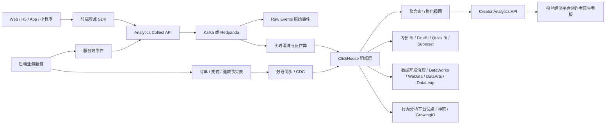

# 粉丝经济平台创作者数据分析最佳实践方案

> 版本：2026-07-09  
> 适用范围：平台级通用方案，不依赖具体源码结构。  
> 目标读者：产品、研发、数据、运维、合规和业务负责人。  
> 现状边界：当前本地仓库只验证到 `creator-insight` 静态原型，其口径说明仍依赖 Google Analytics；本文按“国内自建优先 + 成熟工具采购加速”的方向给出建设建议。

## Executive Summary

- **国内有成熟方案，但不建议把创作者侧核心数据产品完全外包给单一供应商。** 神策、GrowingIO、百度统计、友盟+、火山引擎 DataFinder 等可以覆盖用户行为分析、漏斗、归因和内部增长分析；DataWorks、WeData、DataArts、DataLeap 等可以覆盖数据集成、清洗、调度、治理；FineBI、Quick BI、永洪 BI、Superset 等可以覆盖内部 BI。但粉丝经济平台要给大量创作者展示数据，核心难点是多租户权限、订单口径、内容/商品/创作者实体关系、长期成本和数据资产沉淀，不能只靠通用 BI 或第三方统计后台解决。

- **最佳路线是混合建设：核心数据链路自建，成熟工具采购加速。** 自建采集网关、事件模型、ClickHouse 分析库、指标 API 和创作者前台看板；采购或试点成熟数据治理/BI/行为分析工具，用于内部数据开发、运营分析、埋点治理和灰度期口径对照。

- **Google Analytics 应继续作为管理员参考和迁移期对照，不作为创作者看板主数据源。** GA 在国内网络环境、浏览器拦截、采样/延迟、跨境和用户可解释性上都不适合作为创作者侧可信口径。创作者看到的数据应来自粉丝经济平台一方采集与服务端交易事实。

- **交易类指标必须以服务端事实表为准。** 浏览、来源、点击等可以来自客户端/服务端事件；订单、支付、退款、支持金额、转化率分母/分子必须绑定服务端订单和支付状态。否则创作者会把看板当成结算依据，任何口径偏差都会变成信任问题。

## 1. 建设目标与判断边界

### 1.1 要解决的问题

粉丝经济平台现有方向是为创作者提供“数据洞察”能力，典型指标包括访问来源、浏览量、访客数、内容页表现、商品页表现、转化率、订单贡献等。目前原型说明数据来自 Google Analytics，但这只能作为探索阶段口径，不能直接成为面向创作者的长期数据产品。

原因包括：

- 国内访问 GA 的可达性和稳定性不可控。
- 浏览器、隐私插件、脚本拦截会造成漏数。
- GA 对粉丝经济平台的业务实体不天然理解，例如创作者、内容、商品、方案、订单、支持、退款。
- GA 数据若用于创作者展示，会引入跨境、合规、解释和申诉成本。
- 创作者侧数据平台最终会成为创作者经营工具，不只是站点统计后台。

### 1.2 本方案的目标

1. 给创作者提供可信、可解释、响应快的数据观测大盘。
2. 建立粉丝经济平台自有的一方行为数据和交易归因体系。
3. 支撑产品、运营、增长、风控、客服等内部团队做分析。
4. 在不过度造轮子的前提下，合理采购成熟工具降低建设和运维成本。
5. 为后续推荐、分层运营、创作者增长建议、异常检测预留数据基础。

### 1.3 不做的事情

- 不把第三方统计平台后台直接暴露给创作者。
- 不把客户端埋点当成订单和收入事实。
- 不在第一阶段做完整 CDP、广告投放归因平台、推荐系统或实时个性化营销。
- 不采集单个访客可识别轨迹给创作者查看。

## 2. 国内成熟方案对比

### 2.1 用户行为分析 / CDP / 增长分析

| 方案 | 适合做什么 | 对粉丝经济平台的价值 | 主要风险 | 建议 |
| --- | --- | --- | --- | --- |
| 神策数据 | 用户行为分析、事件分析、漏斗、留存、用户分群、营销科技、咨询交付 | 适合内部增长分析、埋点体系设计、漏斗分析、运营诊断 | 商业授权和事件量成本较高；多租户创作者侧权限和自定义业务口径需要深度适配；供应商锁定 | 可作为内部分析和埋点治理 PoC，不作为创作者看板唯一数据源 |
| GrowingIO | 用户行为分析、增长分析、CDP、广告/渠道分析、A/B 实验 | 适合内部产品和运营团队快速搭建行为分析能力 | 原始明细导出、私有化、服务端事件、长期成本必须逐项确认 | 可试点，要求原始事件同步到自有数仓 |
| 百度统计 | 站点统计、来源、渠道、转化、百度生态营销联动 | 国内站点可达性好，适合作为 GA 的国内替代参考 | 更偏站长/营销统计，不适合承载粉丝经济平台复杂业务实体和创作者多租户产品 | 可作为管理员站点统计参考，不作为核心创作者数据源 |
| 友盟+ | App/Web/小程序统计、来源、路径、漏斗、性能监控 | 若粉丝经济平台有 App、小程序、H5 多端，可用作端侧统计和质量监控补充 | 同样存在业务口径、数据导出、第三方 SDK 合规和长期锁定问题 | 可用于多端基础统计或性能监控，不作为唯一事实源 |
| 火山引擎 DataFinder | 增长分析、行为分析、漏斗、用户分群、A/B 等字节系数据产品能力 | 适合希望购买一套增长分析能力的团队 | 官网页面当前需要 JS 渲染，本文未能充分抓取细节；需以商务资料和 PoC 为准 | 可进入候选清单，但必须验证私有化、导出、权限、成本 |

**结论：** 行为分析平台可以帮助内部团队更快获得分析能力，但创作者侧核心数据产品不应直接建立在这些平台之上。最低要求是：所有核心事件和服务端事实必须进入粉丝经济平台自有数仓；供应商平台只能是消费这些数据或接收同步副本。

### 2.2 数据开发治理 / ETL / DataOps

| 方案 | 适合做什么 | 对粉丝经济平台的价值 | 主要风险 | 建议 |
| --- | --- | --- | --- | --- |
| 阿里云 DataWorks | 数据集成、数据开发、任务调度、数据质量、数据地图、安全治理、数据服务 | 成熟度高，适合阿里云体系内快速搭建数据开发治理平台 | 与阿里云生态绑定较深；成本、跨云能力、私有化模式需确认 | 如果基础设施在阿里云，优先评估 |
| 腾讯云 WeData | 数据集成、数据开发、任务运维、数据地图、数据质量、数据安全 | 适合腾讯云体系内的数据中台和治理建设 | 与腾讯云生态绑定；面向创作者产品的 API 层仍需自建 | 如果基础设施在腾讯云，优先评估 |
| 华为云 DataArts Studio | 数据集成、治理、开发、服务、资产管理 | 适合政企、合规、国产化要求强的环境 | 具体能力、成本和团队熟悉度需 PoC | 若有国产化/信创要求，进入候选 |
| 火山引擎 DataLeap | 数据集成、开发治理、湖仓、数据质量等 | 字节系数据工具链经验，对互联网数据场景有吸引力 | 当前公开页面抓取受 JS 限制，需以厂商材料和 PoC 验证 | 可作为云厂商候选，重点验证开放性和成本 |
| 自建 Airflow/Dagster + dbt + 数据质量工具 | 调度、转换、测试、血缘和文档 | 开放、可控、成本可压缩 | 需要数据工程团队维护，治理能力需要逐步补齐 | 有数据团队时可自建；团队薄弱时先采购 |

**结论：** 数据开发治理平台可以购买，不必第一天自研完整 DataOps。这里的关键不是“买不买”，而是不要让采购平台变成唯一数据归属地。数据模型、指标口径和对外 API 必须由粉丝经济平台掌控。

### 2.3 BI 可视化 / 内部分析

| 方案 | 适合做什么 | 对粉丝经济平台的价值 | 主要风险 | 建议 |
| --- | --- | --- | --- | --- |
| FineBI | 自助 BI、数据处理、权限管控、大数据量分析、内部看板 | 国内成熟，业务人员上手快，适合内部运营/管理分析 | 外嵌到创作者侧会遇到授权、样式、权限、性能和产品体验问题 | 内部 BI 推荐候选，不直接作为创作者前台 |
| Quick BI | 阿里云体系 BI、仪表板、自助分析、报表 | 适合阿里云数仓/湖仓上快速做内部分析 | 云生态绑定，创作者侧多租户产品体验不足 | 内部 BI 候选 |
| 永洪 BI | 企业级 BI、数据建模、指标平台、数据资产、智能问数 | 国内 BI 厂商能力较完整，可支持信创和企业级场景 | 需要评估与现有技术栈、授权方式和外嵌能力 | 内部 BI / 管理驾驶舱候选 |
| Superset | 开源 BI、SQL 数据源、可视化、Dashboard | 低成本、可控、适合技术团队内部使用 | 业务人员自助体验和权限治理不如商业产品；外部多租户仍需二开 | 技术团队内部分析可用 |

**结论：** BI 工具适合内部分析，不适合直接成为创作者侧产品界面。创作者前台应由粉丝经济平台产品内原生页面承载，统一交互、权限、语言和口径说明；BI 负责内部探索和运营分析。

### 2.4 开源和海外工具的定位

| 方案 | 定位 | 建议 |
| --- | --- | --- |
| Matomo | 自托管 Web Analytics，强调数据所有权、隐私和原始数据访问 | 可作为 GA 替代参考，但业务实体和多租户创作者数据仍需自建 |
| Plausible / Umami | 轻量隐私友好 Web Analytics | 适合站点统计，不适合复杂创作者经营分析 |
| PostHog | 产品分析、事件、漏斗、实验、Feature Flag；自托管能力强但运维责任重 | 不建议作为创作者侧核心数据底座；可做内部产品分析试点 |
| Snowplow | 事件采集和数据管道体系 | 架构理念值得参考，但生产部署和许可证边界需谨慎 |
| ClickHouse | 高性能列式 OLAP，适合实时分析和用户侧 Dashboard | 推荐作为自建分析主库或核心候选 |

## 3. 自建 vs 购买服务

### 3.1 总体对比

| 维度 | 全购买服务 | 全自建 | 推荐混合方案 |
| --- | --- | --- | --- |
| 上线速度 | 快，通常 SDK + 配置即可出基础报表 | 慢，需要采集、存储、清洗、查询和看板 | 中等，核心链路自建，内部 BI/DataOps 采购加速 |
| 数据资产 | 原始数据和语义受供应商能力限制 | 完全掌握 | 核心数据自有，供应商消费副本 |
| 创作者多租户权限 | 通用平台常需二开或企业版能力 | 可按业务模型设计 | 对外权限自建，内部工具做补充 |
| 订单/收入口径 | 难与粉丝经济平台交易系统完全一致 | 可直接绑定服务端事实 | 交易事实自建，行为分析工具只做辅助 |
| 长期成本 | 事件量、席位、功能模块费用可能持续上升 | 人力和基础设施成本高，但边际成本可控 | 核心高频链路成本可控，低频能力采购 |
| 运维压力 | 低到中，取决于 SaaS/私有化 | 高 | 中等 |
| 合规与审计 | 依赖供应商材料、合同和部署方式 | 自己负责 | 核心合规自控，供应商纳入审计 |
| 退出迁移 | 可能困难 | 不存在供应商迁移问题 | 通过原始数据自留降低退出风险 |

### 3.2 什么时候应该购买

适合购买的部分：

- 数据开发治理平台：数据集成、调度、数据质量、数据地图、权限审计。
- 内部 BI：运营看板、管理驾驶舱、临时分析、自助取数。
- 行为分析平台试点：埋点设计、漏斗分析、留存分析、内部增长实验。
- 咨询服务：指标体系、埋点规范、数据治理流程、团队培训。

购买前必须确认：

- 是否支持国内部署或私有化。
- 是否支持原始明细数据完整导出。
- 是否支持服务端事件接入。
- 是否支持 Webhook/API 与数仓同步。
- 是否支持行级/列级权限、组织隔离、SSO、审计。
- 是否支持数据保留策略、删除、脱敏、备份和灾备。
- 是否按事件量、数据量、席位、功能模块还是节点计费。
- 是否有清晰 SLA、故障赔偿、升级计划和退出迁移方案。

### 3.3 什么时候必须自建

建议自建的部分：

- 对创作者开放的看板页面和查询 API。
- 创作者、内容、商品、订单、支持、退款等业务事实模型。
- 指标口径层，包括 PV、UV、来源、转化率、订单金额、退款影响等。
- 多租户权限隔离。
- 面向创作者的口径说明、数据延迟提示和异常说明。
- 核心事件明细和聚合结果存储。

理由很简单：这些能力最终会影响创作者信任、平台数据资产和后续产品演进，不适合交给通用第三方后台决定。

## 4. 推荐架构

### 4.1 一句话方案

自建“采集网关 + 事件模型 + ClickHouse 分析库 + 指标 API + 创作者原生看板”，采购“数据开发治理 + 内部 BI + 行为分析试点”来降低建设成本。

### 4.2 架构图



### 4.3 分层设计

| 层级 | 责任 | 建议技术/工具 |
| --- | --- | --- |
| 采集层 | 接收浏览、点击、来源、内容/商品访问、服务端订单事件 | 自建 SDK、`POST /analytics/collect`、服务端事件上报 |
| 缓冲层 | 削峰、重试、回放、隔离在线请求 | Kafka 或 Redpanda |
| 原始层 Raw/ODS | 保留原始事件，支持追溯和重算 | 对象存储 + ClickHouse 原始表 |
| 清洗层 DWD | 去重、过滤机器人、标准化来源、绑定业务实体 | Flink / Kafka Streams / 批处理任务 |
| 汇总层 DWS/ADS | 按创作者、日期、内容、商品、来源聚合 | ClickHouse 物化视图 / 定时任务 |
| 指标服务 | 对外提供统一口径和权限控制 | 自建 API 服务 |
| 展示层 | 创作者数据大盘、内部 BI、运营分析 | 创作者原生页面 + BI 工具 |

## 5. 指标口径

### 5.1 核心指标字典

| 指标 | 默认定义 | 数据来源 | 注意事项 |
| --- | --- | --- | --- |
| 浏览量 PV | 过滤重复上报和明显机器人后的 `page_view` 事件数 | 客户端/服务端页面事件 | 不等同于 Nginx 请求数 |
| 访客 UV | `creator_id + anonymous_id + 日期` 去重；登录后可用脱敏 `member_id_hash` 辅助 | 事件明细 | 不展示单个访客身份 |
| 会话数 Session | 同一匿名访客在 30 分钟无活动后开启新会话 | 事件明细 | 可按产品策略调整 |
| 内容页访问 | `object_type = content` 的页面访问 | 事件明细 + 内容维表 | 需过滤创作者本人预览 |
| 商品页访问 | `object_type = product` 的页面访问 | 事件明细 + 商品维表 | 需绑定创作者和商品状态 |
| 来源渠道 | UTM 优先，其次 referrer domain，再其次 direct/internal/unknown | 事件明细 | 需要国内渠道映射表 |
| 商品转化率 | 支付成功订单数 / 商品页访问 UV 或 PV | 事件 + 订单事实 | 默认用 UV 口径，页面可说明 |
| 支持转化率 | 支付成功支持人数 / 创作者主页或商品页访问 UV | 事件 + 订单事实 | 要区分新支持与续费 |
| GMV / 支持金额 | 支付成功金额，扣除或单列退款影响 | 服务端订单事实 | 不能从客户端事件推断 |
| 退款率 | 退款订单数或退款金额 / 支付成功订单数或金额 | 服务端订单/退款事实 | 面向创作者展示需谨慎 |

### 5.2 来源归因规则

默认采用轻量、可解释的 Last Non-Internal Touch：

1. 如果 URL 有 `utm_source`，优先使用 UTM。
2. 如果没有 UTM，使用 `referrer_domain` 映射渠道，例如微信、微博、B站、抖音、小红书、搜索引擎。
3. 如果 referrer 为空，标记为 `Direct`。
4. 如果 referrer 是粉丝经济平台站内域名，标记为 `Internal`，但向创作者展示时可合并为“站内流转”。
5. 支付归因默认取订单发生前 7 天内同一匿名用户或登录用户的最后一个非站内来源。

边界说明：

- 跨设备、跨浏览器、App 跳转会造成归因缺口。
- 微信/App 内置浏览器可能隐藏或改写来源。
- 创作者分享链接应鼓励自动带 UTM 或渠道参数。
- 对创作者展示时不要过度承诺“精确归因”，应标注为“按当前可识别来源估算”。

## 6. 事件模型与接口

### 6.1 采集接口

```http
POST /analytics/collect
Content-Type: application/json
```

```json
{
  "event_id": "01JZEXAMPLE000000000000000",
  "event_name": "page_view",
  "creator_id": "creator_123",
  "object_type": "product",
  "object_id": "product_456",
  "anonymous_id": "anon_hash",
  "member_id_hash": "member_hash_or_null",
  "session_id": "session_hash",
  "source": "organic_social",
  "utm_source": "weibo",
  "utm_medium": "social",
  "utm_campaign": "summer_2026",
  "referrer_domain": "weibo.com",
  "device": {
    "platform": "web",
    "os": "iOS",
    "browser": "Safari"
  },
  "occurred_at": "2026-07-09T12:00:00+08:00",
  "properties": {
    "path": "/a/creator_123/shop/product_456",
    "title": "创作者支持计划"
  }
}
```

### 6.2 核心事件

| 事件名 | 触发时机 | 关键字段 | 说明 |
| --- | --- | --- | --- |
| `page_view` | 页面可见且路由稳定后 | `creator_id`、`object_type`、`object_id`、`path` | PV/UV 基础 |
| `content_view` | 内容详情页访问 | `content_id`、`creator_id` | 可由 `page_view` 派生，也可显式上报 |
| `product_view` | 商品页访问 | `product_id`、`creator_id` | 商品表现基础 |
| `support_click` | 点击支持/购买按钮 | `target_type`、`target_id` | 漏斗中间步骤 |
| `checkout_start` | 进入支付/确认页 | `order_intent_id` | 客户端辅助，不能代替订单 |
| `order_paid` | 服务端确认支付成功 | `order_id`、`creator_id`、`amount`、`product_id` | 必须由服务端上报 |
| `order_refunded` | 服务端确认退款 | `order_id`、`refund_amount` | 必须由服务端上报 |
| `creator_home_view` | 创作者主页访问 | `creator_id` | 创作者主页分析 |

### 6.3 查询接口

| 接口 | 用途 | 默认查询维度 |
| --- | --- | --- |
| `GET /creator-analytics/summary` | 摘要卡片 | 创作者、日期范围 |
| `GET /creator-analytics/trend` | 访问趋势 | 日期、指标 |
| `GET /creator-analytics/sources` | 来源概览 | 来源、渠道、日期范围 |
| `GET /creator-analytics/content-rank` | 内容表现排行 | 内容、日期范围、排序指标 |
| `GET /creator-analytics/product-rank` | 商品表现排行 | 商品、日期范围、排序指标 |
| `GET /creator-analytics/funnel` | 访问到支付漏斗 | 创作者、对象类型、日期范围 |

所有查询接口必须做：

- 当前登录用户是否有权访问 `creator_id`。
- 默认只返回聚合结果，不返回访客明细。
- 对小样本数据做隐私保护，例如 UV 小于阈值时隐藏细分来源。
- 输出 `data_updated_at` 和口径说明版本。

## 7. 创作者看板产品建议

### 7.1 第一阶段页面

保留当前原型方向，但把“基于 Google Analytics”改为“基于粉丝经济平台自有统计口径”：

- 摘要：访客数、访问次数、内容页访问、商品页访问、支付订单数、转化率。
- 趋势：近 7 天、近 30 天访问和转化趋势。
- 内容表现：内容标题、访问人数、访问次数、平均参与时长、趋势。
- 商品表现：商品名、访问人数、访问次数、支付订单数、转化率、主要来源。
- 来源概览：Direct、搜索、社交、站内、外部推荐、未知。
- 口径说明：数据更新时间、统计延迟、过滤规则、隐私边界。

### 7.2 不建议第一阶段展示

- 单个访客轨迹。
- IP、完整 User-Agent、设备唯一标识。
- 过细地理位置。
- 低样本来源明细。
- 与结算金额不完全一致但容易被误解为结算依据的收入估算。
- 复杂多触点归因模型。

## 8. 推荐建设路线

### 阶段 0：口径冻结与 PoC，2-3 周

目标：

- 确认创作者看板第一版指标范围。
- 定义事件字典和来源映射表。
- 验证 ClickHouse 查询性能。
- 选 1-2 家供应商做 PoC，而不是直接采购大合同。

交付物：

- 指标字典 v1。
- 事件字典 v1。
- 供应商 PoC 评分表。
- GA、服务端日志、自建事件三方对照方案。

### 阶段 1：自建最小可用链路，4-6 周

目标：

- 上线采集 API、事件队列、原始事件表和基础清洗。
- 完成服务端订单/支付/退款事件接入。
- 做创作者看板第一版摘要、趋势、来源、内容/商品排行。

交付物：

- `POST /analytics/collect`。
- ClickHouse 原始表和聚合表。
- 创作者查询 API。
- 内部灰度版创作者看板。
- 数据延迟和失败监控。

### 阶段 2：数据治理和内部 BI，4-8 周

目标：

- 引入或自建数据开发治理工具。
- 建立数据质量规则、任务调度、血缘、审计和告警。
- 给产品/运营/客服开放内部 BI。

交付物：

- 数据任务编排。
- 指标层和数据集市。
- 内部运营看板。
- 数据质量日报。
- 权限和审计策略。

### 阶段 3：创作者经营洞察，8-12 周

目标：

- 从“看数据”升级为“给建议”。
- 提供来源变化、内容增长、商品转化异常、活动效果复盘。
- 增加创作者可操作建议，例如“哪个内容带来最多商品访问”。

交付物：

- 异常检测。
- 内容/商品关联分析。
- 创作者月报。
- 站内流量与站外流量拆解。

## 9. 供应商 PoC 与采购评估清单

### 9.1 必测项

| 检查项 | 验收问题 | 通过标准 |
| --- | --- | --- |
| 国内部署/私有化 | 数据是否可留在国内或私有环境？ | 有明确部署方案和合同条款 |
| 原始明细导出 | 能否导出完整事件明细？ | 支持 API、任务或数据同步，字段完整 |
| 服务端事件 | 能否接收后端订单/支付事件？ | 支持幂等、补发、延迟到达 |
| 权限隔离 | 能否按创作者或组织隔离？ | 支持行级权限或可由粉丝经济平台 API 层控制 |
| 数据删除 | 能否按用户/事件范围删除？ | 支持合规删除和审计 |
| 成本模型 | 事件量增长 10 倍后成本如何？ | 有清晰报价和封顶策略 |
| 退出迁移 | 停用后如何迁出数据？ | 有导出、交接和删除流程 |
| SLA | 故障、延迟、数据丢失如何处理？ | 有 SLA 和赔偿/响应条款 |
| SDK 合规 | SDK 采集哪些字段？ | 有隐私政策、合规文档、可配置开关 |
| 开放 API | 能否与自有数仓、BI、权限系统集成？ | 有稳定 API、Webhook 或数据同步 |

### 9.2 评分建议

| 维度 | 权重 |
| --- | ---: |
| 数据可控性和导出能力 | 25% |
| 服务端事件与业务口径适配 | 20% |
| 私有化/国内部署与合规 | 15% |
| 多租户权限与审计 | 15% |
| 成本和扩展性 | 15% |
| 产品体验和交付服务 | 10% |

如果某供应商不能提供完整原始明细导出，直接降级为“内部辅助工具”，不进入核心链路。

## 10. 数据质量与验收标准

### 10.1 数据口径验收

- PV：同一事件重复上报时按 `event_id` 去重。
- UV：同一天同一创作者下同一 `anonymous_id` 只计一次。
- 来源：有 UTM 时优先 UTM，无 UTM 时使用 referrer，站内 referrer 不覆盖外部来源。
- 内容排行：删除、私密、下架内容要有展示策略。
- 商品转化：支付成功订单必须能回溯到商品和创作者。
- 退款：退款指标单列，不直接静默改写历史支付成功数，避免创作者误解。

### 10.2 权限验收

- 创作者 A 不能查询创作者 B 的任何聚合或明细数据。
- 管理员查询必须记录审计日志。
- 内部 BI 默认不允许导出用户级明细。
- 小样本细分维度应做阈值保护。

### 10.3 灰度验收

上线前 2-4 周做三方对照：

- 自建事件链路。
- GA 或现有站点统计。
- 服务端访问日志/订单事实。

需要解释：

- 为什么 GA 与自建 PV/UV 不一致。
- 为什么服务端日志请求数大于页面 PV。
- 哪些来源因浏览器或 App 限制无法识别。
- 哪些订单无法归因到访问来源。

### 10.4 稳定性验收

- 采集 API 写入失败率可观测。
- 队列积压可告警。
- ClickHouse 查询 P95 延迟满足创作者看板秒级响应。
- 延迟到达事件可重算。
- 指标聚合任务失败可回滚或补跑。

## 11. 风险与应对

| 风险 | 影响 | 应对 |
| --- | --- | --- |
| 创作者把看板数据当结算依据 | 信任和客服压力 | 明确收入以结算系统为准；看板展示统计口径和更新时间 |
| 客户端漏报 | PV/UV 偏低 | 服务端日志抽样对照；关键事件服务端补报 |
| 机器人和爬虫污染 | 数据虚高 | UA/IP/频率/行为规则过滤；保留过滤前后对照 |
| 来源丢失 | 渠道分析不完整 | 推广链接自动 UTM；站内分享链路加参数 |
| 供应商锁定 | 成本和迁移风险 | 原始数据自留；合同写入导出和退出条款 |
| 权限泄漏 | 严重合规和信任风险 | API 层强制 creator scope；内部 BI 做行级权限和审计 |
| 指标口径频繁变化 | 创作者困惑 | 指标版本化；变更公告；历史数据重算策略 |

## 12. 推荐决策

### 12.1 建议采用的组合

1. **核心链路自建。** 自建采集网关、事件模型、ClickHouse、指标 API 和创作者原生看板。
2. **数据治理按团队能力采购。** 如果现阶段没有成熟数据平台团队，优先评估 DataWorks、WeData、DataArts、DataLeap；如果已有强数据工程团队，可采用 Airflow/Dagster + dbt + ClickHouse 的开源组合。
3. **内部 BI 采购或轻量开源。** 业务团队自助分析优先 FineBI/Quick BI/永洪；技术团队内部探索可用 Superset。
4. **行为分析平台只做试点。** 神策/GrowingIO/DataFinder 可用于内部增长分析和埋点治理，但必须同步原始事件到自有数仓。
5. **GA 降级为参考。** 保留管理员对照，不对创作者直接展示 GA 口径。

### 12.2 最小可行技术栈

| 模块 | 推荐 |
| --- | --- |
| 采集 | 自建轻量 SDK + `POST /analytics/collect` |
| 队列 | Redpanda 或 Kafka |
| OLAP | ClickHouse |
| 调度 | 采购 DataOps 或 Airflow/Dagster |
| 建模 | dbt 或平台内建数据开发 |
| 内部 BI | FineBI / Quick BI / 永洪 / Superset |
| 创作者看板 | 粉丝经济平台产品内原生页面 |
| 监控 | Prometheus/Grafana + 日志告警 |

## 13. 参考资料

以下资料用于判断各方案能力边界。部分厂商页面为 JS 渲染，本文只对能从公开页面验证的信息做强结论；不能验证的能力必须进入 PoC 清单。

- [神策数据](https://www.sensorsdata.cn/)：公开页面展示用户行为分析、营销科技、数据驱动增长和行业解决方案能力。
- [GrowingIO](https://www.growingio.com/)：公开页面展示增长分析、CDP、广告获客分析、A/B 实验和咨询服务。
- [百度统计](https://tongji.baidu.com/)：公开页面展示全端数据资产管理、多维智能数据分析、事件/行为流/漏斗/转化归因、API 导出等能力。
- [友盟+](https://www.umeng.com/)：公开页面展示 App/Web/小程序统计、来源、路径、漏斗、性能监控和 OpenAPI 等能力。
- [火山引擎 DataFinder](https://www.volcengine.com/product/datafinder)：页面需 JS 渲染，建议以厂商材料和 PoC 验证。
- [火山引擎 DataLeap](https://www.volcengine.com/product/dataleap)：页面需 JS 渲染，建议以厂商材料和 PoC 验证。
- [阿里云 DataWorks](https://www.aliyun.com/product/bigdata/ide)：公开页面展示数据集成、开发治理、数据质量、安全治理、数据服务等能力。
- [腾讯云 WeData](https://cloud.tencent.com/product/wedata)：公开页面展示数据集成、数据开发、任务运维、数据地图、数据质量、数据安全等能力。
- [华为云 DataArts Studio](https://www.huaweicloud.com/product/dataartsstudio.html)：建议进入国产化/云厂商候选，具体能力以 PoC 验证。
- [FineBI](https://www.fanruan.com/finebi/)：公开页面展示自助 BI、数据处理、权限管控、大数据量分析和企业应用案例。
- [永洪科技](https://www.yonghongtech.com/)：公开页面展示企业级 BI、数据建模、指标平台、数据资产平台、智能问数等产品。
- [ClickHouse Real-time Analytics](https://clickhouse.com/use-cases/real-time-analytics)：官方页面说明其适用于实时分析、用户侧 Dashboard、高并发查询和物化视图等场景。
- [Matomo](https://matomo.org/)：官方页面强调自托管、数据所有权、隐私和原始数据访问。
- [Plausible Self-hosted](https://plausible.io/self-hosted-web-analytics)：官方页面说明自托管责任、云版与 CE 差异、轻量隐私友好定位。
- [PostHog Self-host](https://posthog.com/docs/self-host)：官方文档说明自托管责任、基础设施要求和风险。
- [Snowplow Self-hosted](https://docs.snowplow.io/docs/get-started/self-hosted/)：官方文档说明自托管能力、成本和 Community Edition 使用边界。
